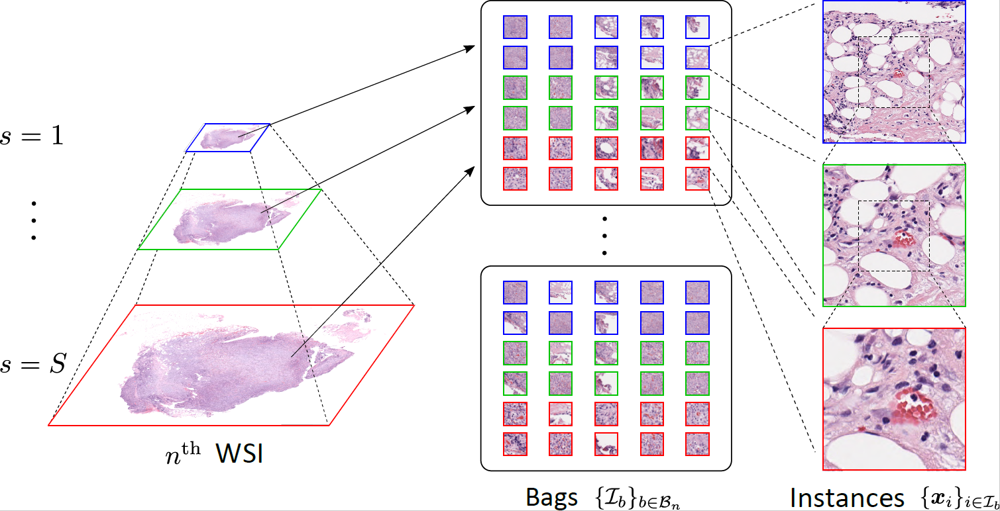
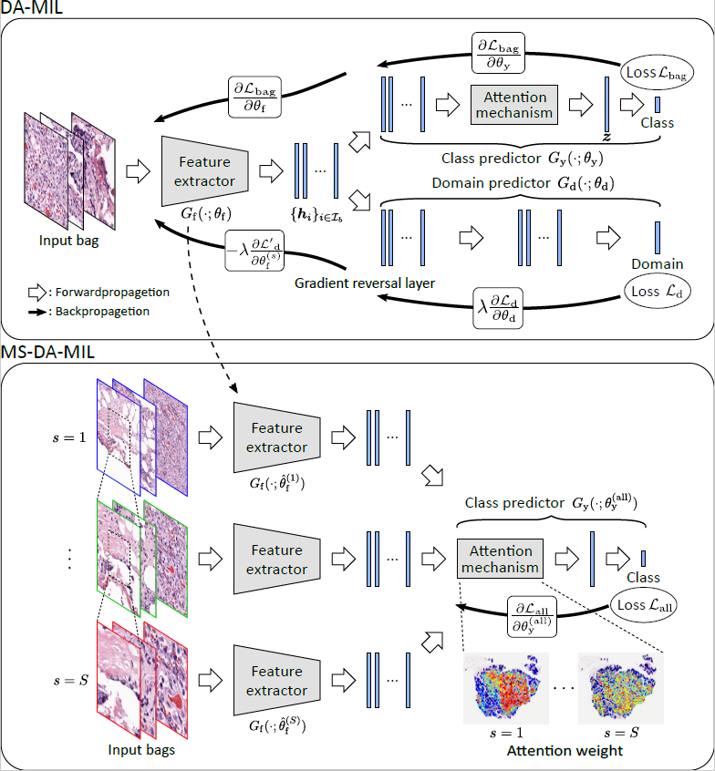
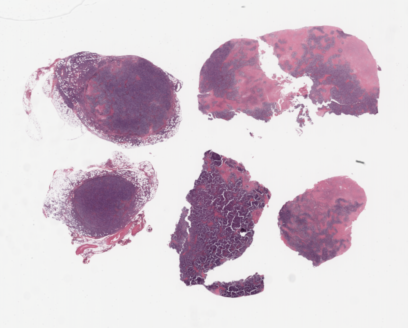
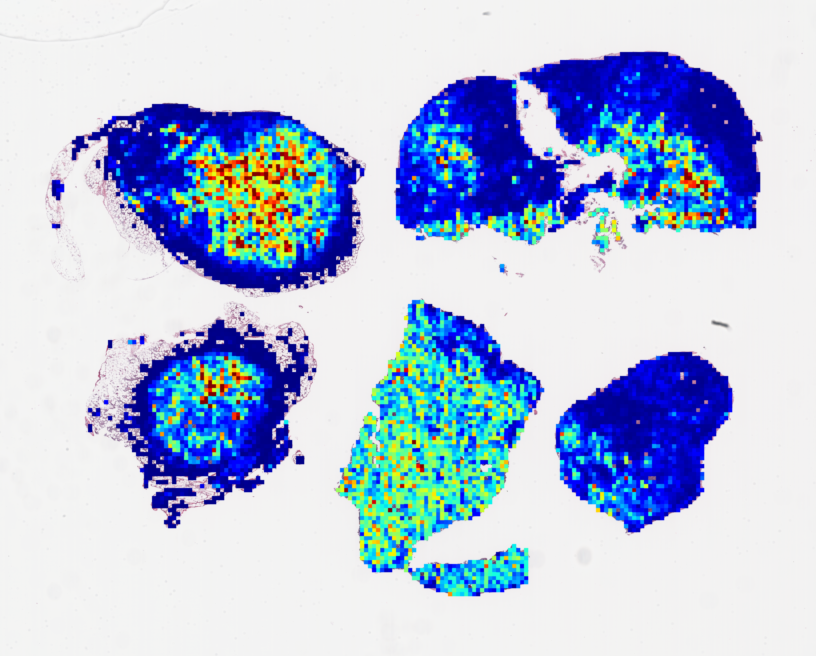

# Multi-scale Domain-adversarial Multiple Instance Learning CNN (CVPR2020)
<div align="center">




</div>

## Abstract
We propose a new method for cancer subtype classification from histopathological images, which can automatically detect tumor-specific features in a given whole slide image (WSI). The cancer subtype should be classified by referring to a WSI, i.e., a large-sized image (typically 40,000x40,000 pixels) of an entire pathological tissue slide, which consists of cancer and non-cancer portions. One difficulty arises from the high cost associated with annotating tumor regions in WSIs. Furthermore, both global and local image features must be extracted from the WSI by changing the magnifications of the image. In addition, the image features should be stably detected against the differences of staining conditions among the hospitals/specimens. In this paper, we develop a new CNN-based cancer subtype classification method by effectively combining multiple-instance, domain adversarial, and multi-scale learning frameworks in order to overcome these practical difficulties.

This document explains how to use the source code for multi-scale domain-adversarial multiple-instance leaning (MS-DA-MIL) CNN in ref[1]. The proposed algorithm focuses on binary classification problem for digital pathological images where each slide is classified into diffuse large B-cell lymphoma (DLBCL) or non-DLBCL. The classification of lymphoma subtypes and visualization of attention weights are explained below. We mention the case of using two magnifications x10 and x20, while MS-DA-MIL allows us to use multi-scale inputs more than two.

## Environmental Requirement
We confirmed that the source code was running with the following environment.

- python 3.6
- numpy 1.18.1
- opencv-python 4.2.0.32
- pillow 6.1.0
- pytorch 1.4.0
- CUDA 10
- NVIDIA Quadro RTX 5000


## Structure of directories and experimental dataset

We assume the following structure of directories.

```
root/
　　├ Lymphoma/
　　└ MSDAMIL/
　　　　├ Adaptive_Grad_Reverse_Layer.py
　　　　├ dataset.py
　　　　├ eval.py
　　　　├ model.py
　　　　├ utils.py
　　　　├ single_train.py
　　　　├ single_test.py
　　　　├ multi_train.py
　　　　├ draw_heatmap_single.py
　　　　└ draw_heatmap_multi.py
```
An example of structure of directory 'Lymphoma' is as follows.
```
Lymphoma/
　　├ thumb/
　　└ patches/
　　　　├ test_bags/
　　　　├ x10/
　　　　└ x20/
　　　　　　├ slideID(1)/
　　　　　　├ ⁝
　　　　　　└ slideID(slide_max)/
　　　　　　　　├ slideID_patchID(1).tif
　　　　　　　　├ ⁝
　　　　　　　　└ slideID_patchID(patch_max).tif
```
The explanation of each directory is as follows.
- 'thumb': Thumbnails of WSIs are saved and they are used for visualization of attention weights.
- 'patches': Image patches extracted from WSIs are saved. Image patches for each magnification are saved in the corresponding directories. The same patchID images in different magnifications have the same center regions. It is assumed that each patch is extracted from an original huge image from the upper left to the lower right as 1 to patch_max (named as patchID).
- 'test_bags': Image patches of bags for testing are saved in advance so that testing bags does not change in each experiment.

**Please add directories for output files and specify them in each source code.**

## Usage
### Single-scale DA-MIL
Set the following parameters in 'single_train.py'.
- 'train_slide': Split-number for training slides (ex. '123'). We assume that all slides were divided to 5 groups (1-5) for 5-fold cross-validation.
- 'valid_slide': Split-number for validation slides (ex. '4')
- 'mag': magnification ('x10' or 'x20' in our setting)
- 'EPOCHS': The number of training epochs
- 'DArate': Domain-adversarial regularization parameter α (ex. 0.001)

Execute the following command to start training DA-MIL.

    $ python single_train.py

The following files are generated.
(ex. train_slide='123', 'valid_slide'=4, mag='x10', DArate=0.001)
- 'train_log/log_x10_train-123_DArate-0.001.csv'
- 'valid_result/x10_train-123_valid-4_DArate-0.001.csv'
- 'model_params/x10_train-123_DArate-0.001.pth'

Accuracy, precision and recall can be calculated by 'eval.py' as follows.

    $ python eval.py valid_result/x10_train-123_valid-4_DArate-0.001.csv

Test can be performed by 'single_test.py' as follows.

    $ python single_test.py x10 123 5 0.001

- 1st argument: Magnification for testing data
- 2nd argument: Split-number for training slide
- 3rd argument: Split-number for testing slide (ex. 5)
- 4th argument: DArate for highest accuracy on validation

The following file is generated.

- 'test_result/x10_train-123_test-5_DArate-0.001.csv'

'draw_heatmap_single.py' can visualize attention weights written in csv files as the following.

    $ python draw_heatmap_single.py valid_result/x10_train-123_valid-4_DArate-0.001.csv x10_norm x10_heatmap

- 1st argument: Path for test_result file
- 2nd argument: Directory to save attention weights normalized for each slide
- 3rd argument: Directory to save visualized heatmap

<div align="center">



</div>

### Multi-scale DA-MIL

Set the following parameters in 'multi_train.py'.
- 'train_slide': Split-number for training slides (ex. '123')
- 'test_slide': Split-number for testing slides (ex. '5')
- 'EPOCHS': The number of training epochs
- 'x10_params': Model parameter file trained for x10
- 'x20_params': Model parameter file trained for x20

'train_slide' should be matched parameter files
(ex. if train_slide='123', specify x10_params=model_params/x10_train-123_DArate-0.001.pth)

Execute the following command to start training DA-MIL.

    $ python multi_train.py

The following files are generated.
(ex. train_slide='123', 'valid_slide'=5)

- 'multi_train_log/log_x10_train-123.csv'
- 'multi_test_result/train-123_test-5.csv'
- 'multi_model_params/train-123.pth'

Accuracy, precision and recall can be calculated by 'eval.py' as follows.

    $ python eval.py multi_test_result/train-123_test-5.csv

'draw_heatmap_multi.py' can visualize attention weights written in csv files as the following.

    $ python draw_heatmap_multi.py multi_test_result/train-123_test-5.csv x10-20_norm x10-20_heatmap

- 1st argument: Path for test_result file
- 2nd argument: Directory to save attention weights normalized for each slide
- 3rd argument: Directory to save visualized heatmap


---
## Reference

[1] N. Hashimoto, D. Fukushima, R. Koga, Y. Takagi, K. Ko, K. Kohno, M. Nakaguro, S. Nakamura, H. Hontani and I. Takeuchi, "Multi-scale domain-adversarial multiple-instance CNN for cancer subtype classification with unannotated histopathological images," Proc. IEEE Conference on Computer Vision and Pattern Recognition, pp. 3852-3861, June 2020.

Last update: July 10, 2020
